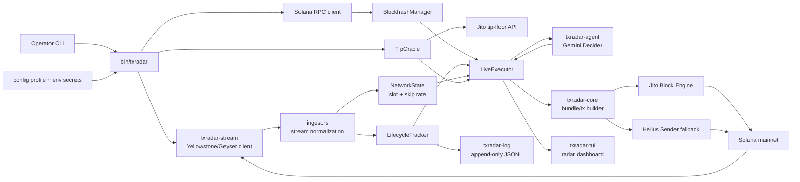
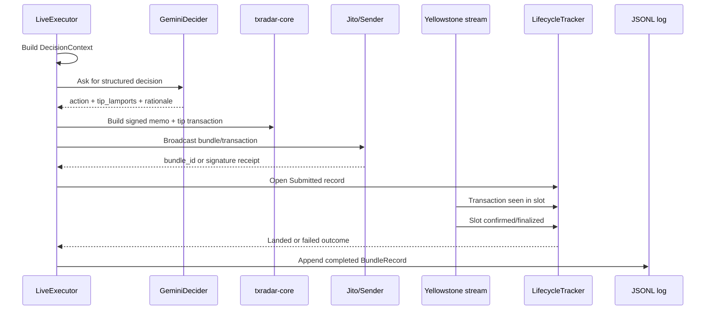
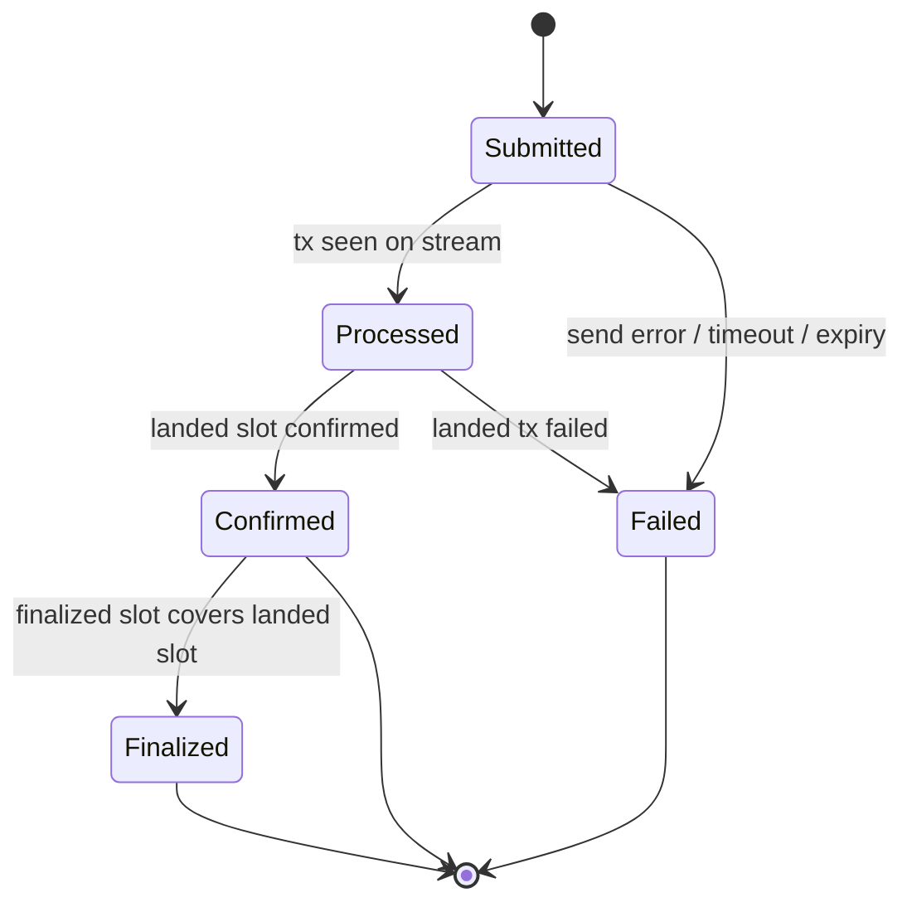
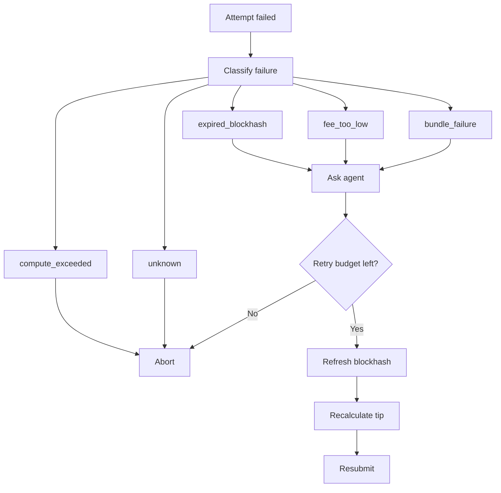

# TxRadar Architecture Design Document

Submission format: Notion public page

Project: TxRadar
Contest: Advanced Infrastructure Challenge - Build a Smart Transaction Stack
Repository role: Rust implementation of a Solana transaction infrastructure stack
Document version: 2026-06-25

## 1. Executive Summary

TxRadar is a Rust-based Solana smart transaction stack built for reliable,
observable, and agent-assisted transaction landing. It is not a simple
`sendTransaction` script. The system watches live chain state through a
Yellowstone/Geyser stream, builds locally signed tipped transactions or Jito
bundles, submits through a fast broadcast path, confirms landing from stream
events, tracks the full lifecycle from `Submitted` to `Finalized`, classifies
failures, and lets an AI agent make the operational retry and tip decisions.

The production command is:

```powershell
cargo run -p txradar -- run --count 10 --starve 2
```

For the final mainnet campaign, TxRadar produced 14 real mainnet records:

- 8 landed transactions
- 6 classified failures
- 8 explorer-verifiable landed slots:
  `427720092`, `427720154`, `427720219`, `427720283`, `427720340`,
  `427720890`, `427720954`, `427721028`
- Failure classes observed: `bundle_failure` and `expired_blockhash`

The final campaign used direct Jito `sendBundle` for intentionally starved
failure evidence and Helius Sender as a fallback broadcast path when public Jito
block-engine access was saturated. In both cases, landing was confirmed from the
live Yellowstone/Geyser stream, not only from RPC polling.

## 2. Design Goals

TxRadar was designed around the contest requirements:

1. Build a working transaction infrastructure stack, not only a demo script.
2. Use Yellowstone/Geyser streaming for real-time chain visibility.
3. Build and submit tipped bundle-style transactions through Jito-compatible
   infrastructure.
4. Track every lifecycle transition: `Submitted -> Processed -> Confirmed ->
   Finalized`.
5. Classify failures and demonstrate recoverable failure handling.
6. Let an AI agent own a real operational decision with visible reasoning.
7. Produce a lifecycle log with real mainnet submissions and failures.
8. Keep the architecture clear enough for independent judging.

## 3. High-Level Architecture



At runtime, the binary owns orchestration. Each crate has a narrow
responsibility so the AI policy layer, chain execution layer, stream layer, and
logging layer remain independently testable.

## 4. Component Responsibilities

| Component | Location | Responsibility |
| --- | --- | --- |
| Orchestrator | `bin/txradar` | Loads profile and secrets, starts streams, builds the executor, runs live campaigns, demo fault mode, TUI mode, and lifecycle logging. |
| Stream client | `crates/txradar-stream` | Connects to Yellowstone/Geyser, subscribes to slots and fee-payer transactions, sends keepalive pings, handles reconnects and replay from the last observed slot. |
| Stream ingest | `bin/txradar/src/ingest.rs` | Converts raw stream events into tracker updates and a shared network state containing current slot, connection state, and recent skip rate. |
| Core stack | `crates/txradar-core` | Handles blockhash refresh, bundle/transaction construction, Jito JSON-RPC calls, Helius Sender fallback, Solana RPC helpers, and lifecycle tracking. |
| Tip oracle | `crates/txradar-tips` | Fetches live Jito tip-floor percentiles, applies EMA smoothing, computes a bounded low/mid/high tip band, and passes signals to the agent. |
| AI agent | `crates/txradar-agent` | Receives live decision context and returns structured actions: `submit`, `hold`, `refresh_and_resubmit`, or `abort`, plus a tip and rationale. |
| Lifecycle log | `crates/txradar-log` | Writes one append-only JSON line per attempt, flushing completed records for judging and auditability. |
| Shared types | `crates/txradar-types` | Defines config, lifecycle stages, failure taxonomy, timings, and `BundleRecord` schema. |
| Radar dashboard | `crates/txradar-tui` | Shows current slot, connection state, tip band, lifecycle table, failures, and AI rationale feed. |

## 5. Runtime Data Flow

### 5.1 Startup and Configuration

1. The operator selects a profile with `TXRADAR_PROFILE`, usually `mainnet`.
2. `bin/txradar` loads `config/<profile>.toml`.
3. Secrets are merged from environment variables and ignored local env files:
   `TXRADAR_KEYPAIR_PATH`, `TXRADAR_YELLOWSTONE_X_TOKEN`,
   `TXRADAR_RPC_API_KEY`, `GEMINI_API_KEY`, `TXRADAR_JITO_UUID`,
   `TXRADAR_BROADCAST`, and `TXRADAR_HELIUS_SENDER_URL`.
4. Secrets are only logged as present/missing, never by value.
5. The live `run` command fails fast if the keypair or Yellowstone token is
   missing.
6. A preflight balance check ensures the fee payer can cover the configured
   worst-case retry budget before any broadcast happens.

### 5.2 Stream Ingest and Network State

1. `txradar-stream` opens a Yellowstone/Geyser gRPC connection.
2. It subscribes to slot updates at processed commitment and transaction updates
   touching the fee-payer account.
3. The stream task emits normalized events:
   `SlotStatus`, `Transaction`, `Connection`, and optional `Leader`.
4. `ingest.rs` feeds slot commitments and watched transaction updates into the
   shared `LifecycleTracker`.
5. `ingest.rs` also maintains `NetworkState`, including:
   current observed slot, connection status, and a recent skipped-slot estimate.

The skip-rate estimate is computed from gaps in the confirmed-slot stream. It is
used as a congestion and competition signal by the tip oracle and agent.

### 5.3 Decision Context Construction

For every initial submission and every post-failure retry decision, the
executor builds a `DecisionContext` containing:

- decision kind: initial submit or post-failure
- attempt id
- current slot from the stream
- current block height from RPC
- current blockhash validity and `lastValidBlockHeight`
- live Jito tip-floor percentiles
- bounded tip band from the tip oracle
- recent skip rate
- previous failure class
- previous tip
- retry count and retry budget

This context is serialized and sent to the AI decider.

### 5.4 Agent Decision Loop



The executor does not hardcode a retry sequence. It executes the agent's chosen
action, observes the outcome, and asks again after failure. A budget guard stops
any decider from retrying beyond the configured maximum.

### 5.5 Transaction and Bundle Construction

TxRadar signs transactions locally. The common Jito path builds a
single-transaction bundle:

1. SPL Memo instruction carrying an auditable TxRadar note.
2. SOL tip transfer to a randomly selected Jito tip account.
3. Recent blockhash fetched at `confirmed` commitment.
4. Local fee-payer signature.
5. Base64 serialization for `sendBundle`.

The tip is in the same transaction as the useful instruction. If the bundle does
not land, the tip is not paid.

For Helius Sender fallback, TxRadar builds a similar locally signed transaction,
with Sender's required tip account and compute budget instructions.

### 5.6 Broadcast and Confirmation

The direct Jito path calls `sendBundle`. That returns a receipt, not proof of
landing. TxRadar therefore treats the receipt as only `Submitted`.

The authoritative landing signal is the Yellowstone/Geyser stream:

1. A watched transaction appears in a processed slot.
2. That slot reaches confirmed commitment.
3. A later finalized slot finalizes the landing retroactively.
4. The tracker computes timing deltas and completes the record.

Jito inflight status polling is kept only as a backup fast-fail signal.

## 6. Lifecycle State Machine



Every successful lifecycle record stores:

- bundle id or sender receipt
- primary transaction signature
- blockhash
- last valid block height
- landed slot
- submitted, processed, confirmed, and finalized timestamps when available
- `submit_to_processed_ms`
- `processed_to_confirmed_ms`
- `confirmed_to_finalized_ms`
- tip amount
- agent rationale

Every failed record stores a terminal failure class.

## 7. Infrastructure Decisions

### Rust Workspace

Rust was chosen for a low-latency, strongly typed transaction stack. The
workspace is split into small crates so the policy layer, stream layer, chain
execution layer, UI, and logging can be tested separately.

### Network Profiles

Network choice is pure configuration. Testnet and mainnet use the same code
path and switch by profile:

- `config/testnet.toml` for development and no-risk testing
- `config/mainnet.toml` for the graded campaign

Mainnet was used for the final lifecycle campaign because judges can
cross-reference slots and signatures on public explorers.

### Yellowstone/Geyser Streaming

TxRadar uses Yellowstone/Geyser for slot and transaction streaming because the
contest rewards real-time infrastructure behavior. The stream is the primary
source for landing confirmation and commitment progression. RPC is used for
blockhashes, block height, balance checks, and diagnostics.

### SolInfra RPC and gRPC

The mainnet profile uses SolInfra Frankfurt endpoints:

- RPC base: `https://fra.rpc.solinfra.dev/sol`
- Yellowstone gRPC: `https://fra.grpc.solinfra.dev:443`

The RPC API key and Yellowstone x-token are separate secrets and are injected at
runtime.

### Jito Block Engine

The preferred transport is direct Jito `sendBundle`, configured against the
Frankfurt mainnet block-engine endpoint to stay regionally close to SolInfra.
The client enforces a request gate and backs off when public endpoints report
global rate limits.

### Helius Sender Fallback

The preferred transport is direct Jito `sendBundle`, and the stack issues real
bundles: the lifecycle log carries genuine Jito `bundle_id`s and `bundle_failure`
classifications as the receipts of those submissions.

During the final campaign, public Jito block-engine access was globally saturated
across all regions (bundles returned `Invalid`/rate-limit errors). Rather than
stop at the degraded dependency, the system does what a production stack should:
`TXRADAR_BROADCAST=hybrid` keeps direct Jito as the preferred path but falls back
to a staked-connection path (Helius Sender) for competitive mainnet landings,
preserving the same tip economics and still confirming every landing from the
live Yellowstone/Geyser stream rather than the sender's response.

This is deliberate resilience, not hidden behavior: each record shows whether it
came from Jito (`bundle_id`) or the fallback (`helius-sender:<signature>`). A
stack that keeps landing when its preferred transport degrades is a strength, not
a shortcut.

### Blockhash Commitment

Blockhashes are fetched at `confirmed`, never `finalized`, because finalized
blockhashes have already consumed a meaningful part of their validity window.
The `BlockhashManager` stores `lastValidBlockHeight` and exposes expiry
detection to the agent loop.

### AI Provider

The default AI provider is Google Gemini through the Generative Language API,
using `gemini-2.5-flash`. It is isolated behind a `Decider` trait so it can be
replaced or mocked. If `GEMINI_API_KEY` is absent, a deterministic heuristic
fallback can run dry paths, but the final AI demonstration should use Gemini.

### Append-Only Logs

Lifecycle evidence is append-only JSONL. Demo fault records are written to a
separate demo path so simulated records never pollute the graded mainnet log.

## 8. AI Agent Responsibilities

The AI agent owns the operational decision. It does not merely summarize logs.

For each decision point it receives live state and must return:

- `action`: `submit`, `hold`, `refresh_and_resubmit`, or `abort`
- `tip_lamports`: the exact tip to use
- `rationale`: one concise explanation stored in the lifecycle record and shown
  in the TUI

The agent is responsible for:

1. Tip intelligence: selecting a tip inside the bounded live tip band.
2. Retry reasoning: deciding whether a failure is recoverable.
3. Blockhash-expiry recovery: choosing refresh and resubmit when expiry is the
   cause.
4. Failure escalation: raising tips after recoverable competition failures.
5. Abort decisions: stopping when the retry budget is exhausted or the failure
   is not recoverable.

The agent is not responsible for:

- holding private keys
- signing transactions
- bypassing the retry budget
- writing logs directly
- deciding hidden actions outside the structured schema

## 9. Failure Handling Strategy



Failure classification is centralized in `txradar-core::tracker` and shared
with the agent through the `FailureClass` enum:

| Failure | Detection | Recovery |
| --- | --- | --- |
| `expired_blockhash` | Window passed, forced stale demo fault, or blockhash-not-found error | Agent can refresh blockhash, recalculate tip, and resubmit. |
| `fee_too_low` | Fee or priority related error text | Agent can raise tip within configured bounds. |
| `bundle_failure` | Jito failure, landed tx error, skipped/dropped bundle style failures | Agent may retry with fresh blockhash and stronger tip if budget remains. |
| `compute_exceeded` | Compute budget related error | Abort; retrying with only a different tip is not the correct fix. |
| `unknown` | No reliable mapping | Abort unless explicitly handled by a future policy. |

Additional infrastructure failures are handled as follows:

- Missing keypair or Yellowstone token: fail fast before broadcast.
- Insufficient fee-payer balance: fail preflight before broadcast.
- Yellowstone auth, permission, or balance rejection: fatal stream error, no
  reconnect spin.
- Yellowstone transient disconnect: reconnect with exponential backoff and
  replay from the last slot when supported.
- Jito public endpoint rate limit: throttle and exponential backoff; hybrid mode
  can fall back to Helius Sender.
- Tip-floor API unavailable: use a conservative fallback floor clamped to
  operator spend bounds.
- Gemini 429, 5xx, DNS, connect, or timeout failure: retry with exponential
  backoff and honor server retry hints.
- No TUI terminal available: run the plain logged path instead.

## 10. Fault Injection and Demo Mode

The required autonomous blockhash-expiry recovery is demonstrated by:

```powershell
cargo run -p txradar -- demo-fault
```

This mode signs real transactions but does not broadcast them. The first submit
forces the current blockhash stale and returns `expired_blockhash` without
spending SOL. The agent then receives a post-failure decision context and must
choose `refresh_and_resubmit` with a recalculated tip. The successful simulated
landing is tagged with a `-sim` network suffix and written to
`logs/lifecycle-demo.jsonl`, separate from the graded mainnet log.

## 11. Observability and Evidence

TxRadar has three observability surfaces:

1. Structured tracing logs for operator diagnosis.
2. Radar TUI for live slot, tip, lifecycle, and agent-reasoning visibility.
3. Append-only lifecycle JSONL for judging.

The curated mainnet evidence is:

- `logs/curated/lifecycle-mainnet-2026-06-20.jsonl`
- `logs/curated/lifecycle-mainnet-2026-06-20.md`

The campaign produced 14 real mainnet records, including 8 landings and 6
failures. The landed records include signatures and slots that can be verified
on public Solana explorers.

## 12. Security and Cost Controls

TxRadar uses several safeguards:

- Secrets stay in environment variables or ignored `.env.local` files.
- Secret values are never printed; only presence is logged.
- The Gemini API key is sent in a header, not in the URL.
- The fee payer is loaded from a local keypair path and signs locally.
- Mainnet tip bounds are configured in `[tips]` and enforced by the oracle.
- Preflight balance checks prevent underfunded live runs.
- Retry budgets prevent runaway autonomous loops.
- Demo fault mode cannot spend SOL because it never broadcasts.
- Simulated logs are separated from graded logs.

## 13. Scalability and Backpressure

The stream layer uses a bounded channel and configurable gRPC flow-control
window so the stream cannot grow unbounded in memory. Reconnect backoff prevents
tight retry loops. Shared tracker and network state are guarded by short
`Arc<Mutex<_>>` critical sections and are never held across async waits.

Jito calls are rate-gated because public block-engine endpoints are heavily
rate-limited. The lifecycle tracker can follow multiple attempts, but the
campaign intentionally runs logical transactions sequentially so blockhash
freshness, retry causality, and logs remain easy to audit.

## 14. Key Tradeoffs

| Decision | Why it was chosen | Tradeoff |
| --- | --- | --- |
| Confirm landing from stream | Stronger evidence than treating a Jito receipt as landed | Requires Yellowstone credentials and stream reliability. |
| Fetch blockhash at confirmed | Preserves usable validity window | Slightly less final than finalized, but appropriate for time-sensitive sends. |
| Keep tip in same transaction | Avoids paying tip on failed/non-landed attempts | The core transaction and tip are tied together. |
| Use hybrid broadcast fallback | Public Jito endpoint saturation should not block all landings | Logs must clearly identify transport used. |
| AI behind `Decider` trait | Makes agent responsibility real and testable | Requires schema discipline and budget guard. |
| JSONL log | Simple, append-only, easy to audit | Needs curation for human-readable submission summary. |

## 15. Operational Runbook

Dry run the autonomous fault recovery:

```powershell
cargo run -p txradar -- demo-fault
```

Run the TUI version:

```powershell
cargo run -p txradar -- demo-fault --tui
```

Run the final mainnet campaign:

```powershell
$env:TXRADAR_PROFILE="mainnet"
$env:TXRADAR_BROADCAST="hybrid"
cargo run -p txradar -- run --count 10 --starve 2
```

After the run, curate the generated `logs/lifecycle.jsonl` into
`logs/curated/` and include the public architecture document URL in the
submission.

## 16. Summary

TxRadar's architecture separates live chain sensing, transaction construction,
AI decision-making, broadcast, lifecycle tracking, and audit logging into clear
components. The system prioritizes stream-confirmed landing evidence, fresh
blockhash handling, bounded dynamic tips, classified failure recovery, and
transparent AI rationale. The final mainnet campaign demonstrates that the
architecture works under real infrastructure conditions, including public Jito
rate-limit pressure and fallback transport decisions.

## 17. References

- Contest listing: https://superteam.fun/earn/listing/advanced-infrastructure-challenge-build-a-smart-transaction-stack/
- Main project README: `README.md`
- Local architecture notes: `docs/ARCHITECTURE.md`
- Required README answers: `docs/README-answers.md`
- Curated lifecycle evidence: `logs/curated/lifecycle-mainnet-2026-06-20.md`
